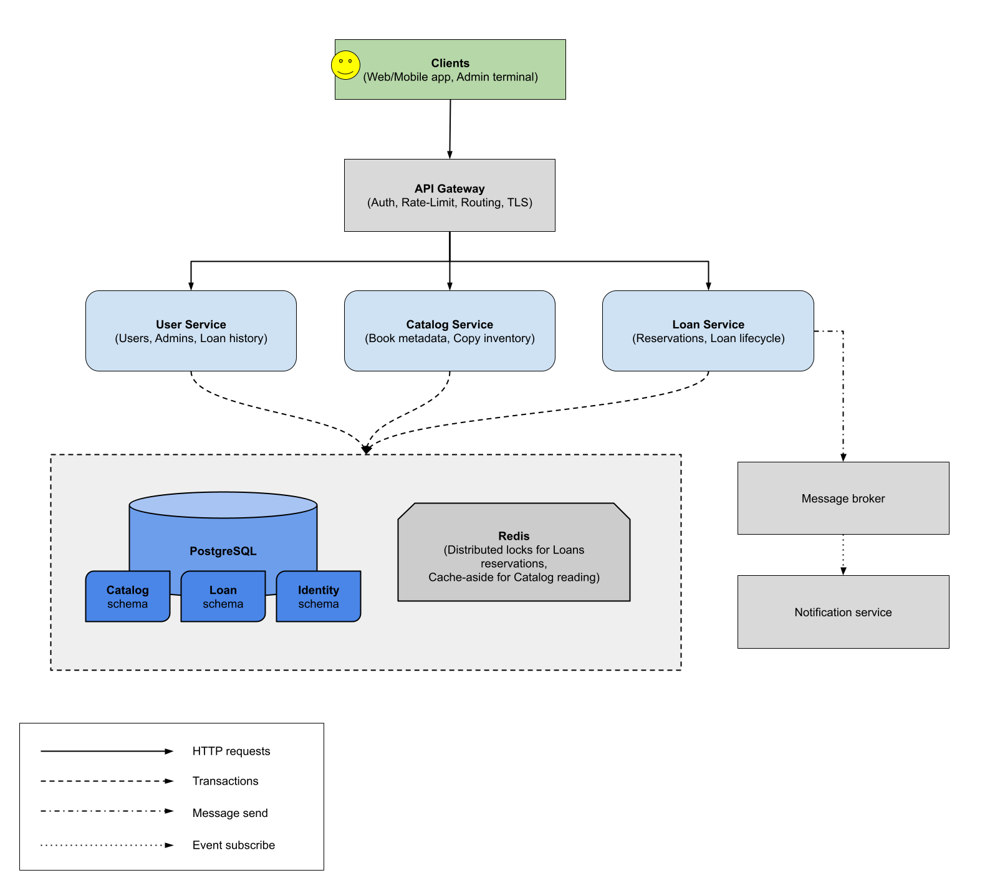
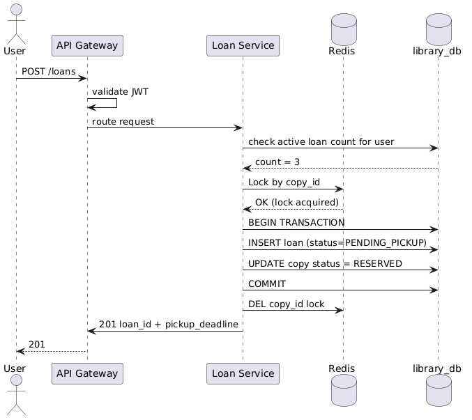
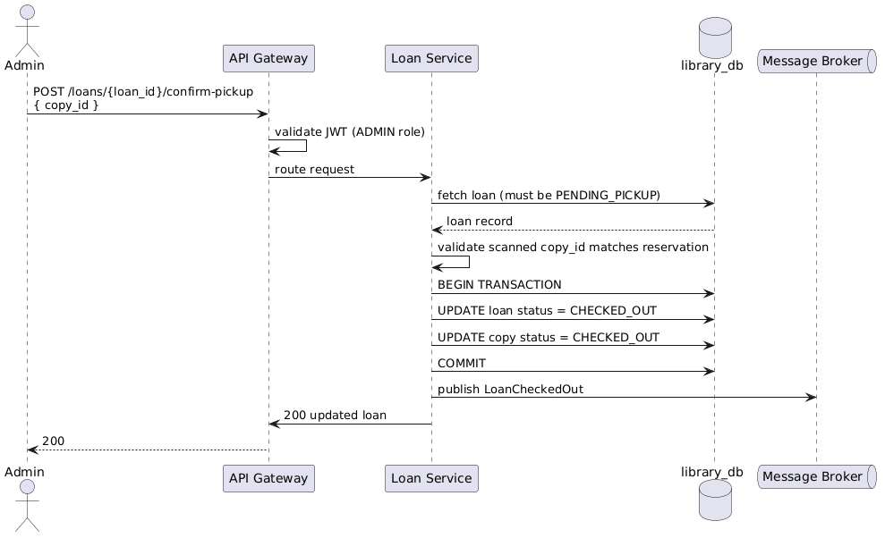
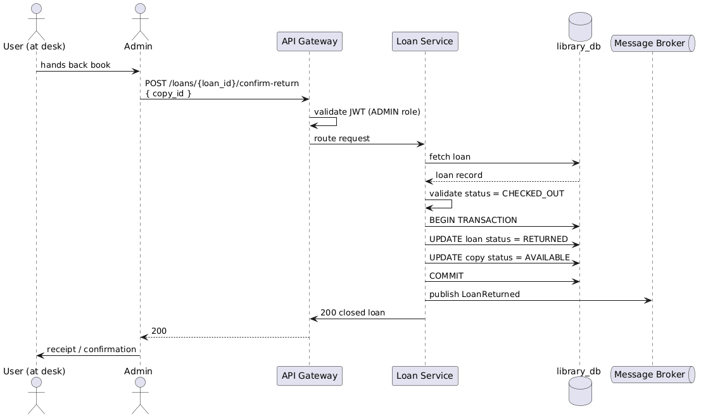

# Architecture — Library Check-In / Check-Out System

---

## Table of Contents

1. [Assumptions & Design Constraints](#1-assumptions--design-constraints)
2. [Functional Requirements](#2-functional-requirements)
3. [Non-Functional Requirements](#3-non-functional-requirements)
4. [High-Level Architecture](#4-high-level-architecture)
5. [Microservices](#5-microservices)
6. [Database schemas](#6-database-schemas)
7. [Check-out/Check-in Flow Diagrams](#7-check-outcheck-in-flow-diagrams)

---

## 1. Assumptions & Design Constraints

- A library can have multiple physical copies of the same book title. Each copy has its own unique id
- A user must be logged in to reserve a book or to see their loan history
- Users can have up to 5 active loans at a time. This limit is configurable per library
- The loan period is 14 days, counted from the moment the admin hands the book over
- Only library staff can add books, add copies, confirm pickups and confirm returns
- As simplification a book can only be picked up and returned in person at the library
- Reservations that are not collected within 3 days are automatically canceled and the copy becomes available again
- We use ISBN to identify a book title and a separate copy id to identify a specific physical item on the shelf
- Notification (reminders, overdue alerts) reacts asynchronously to events; it does not need to be real-time

---

## 2. Functional Requirements

User can:
- Search the catalog and reserve an available copy of a book
- Cancel their reservation before picking the book up
- View their active reservations, current loans, and past loan history

Admin can:
- Confirm the user picked up the book, which starts the loan period
- Confirm return that book was handed back, which closes the loan
- Add a new book title to the catalog.
- Add new physical copies to an existing title.
- See a list of all pending pickups and all overdue loans.

Automated:
- Reservations that have not been picked up are expired automatically.
- Notifications are sent when a reservation is confirmed, when the due date is approaching, and when a loan goes overdue.

---

## 3. Non-Functional Requirements

- Strong consistency for checkout/return (prevent double-checkout of a copy)
- Horizontally scalable; stateless services
- Security via OAuth 2.0; data encrypted at rest and in transit 
- Auditability - all mutations logged to an immutable audit trail

---

## 4. High-Level Architecture



---

## 5. Microservices

### 5.1 Catalog Service
Manages the library's catalog — book titles (metadata) and their physical copies.

Endpoints:

- POST `/catalog/books` - Add a new book title (admin only)
- GET  `/catalog/books/{isbn}` - Retrieve book metadata
- POST `/catalog/books/{isbn}/copies`  - Add physical copies to a title (admin only)
- GET  `/catalog/books/{isbn}/copies` - List copies and their current availability status
- GET  `/catalog/search?q=` - Full-text search across title/author/genre

Key Concerns:
- Read-heavy; uses cache-aside with Redis for catalog reads — on a miss the service fetches from DB and populates the cache; on a copy status change the affected keys are invalidated
- Full-text search via OpenSearch/Elasticsearch
- Publishes BookAdded and CopyAdded events after each successful write; these are informational and consumed by the search indexer

---

### 5.2 Loan Service
Orchestrates the loan lifecycle — reservation, pickup confirmation, return confirmation, and cancellation.

Endpoints:
- POST   `/loans` - Reserve a copy (user; creates loan in `PENDING_PICKUP` status)
- GET    `/loans/{loan_id}` - Get loan details
- DELETE `/loans/{loan_id}` - Cancel a pending reservation (user or admin)
- POST   `/loans/{loan_id}/confirm-pickup` - Confirm user has collected the book (admin only; transitions to `CHECKED_OUT` status)
- POST   `/loans/{loan_id}/confirm-return` - Confirm user has returned the book (admin only; closes the loan)
- GET    `/loans/overdue` - List all overdue loans (admin)
- GET    `/loans/pending-pickup` - List all reservations awaiting collection (admin)

Key Concerns:
- Must atomically reserve a copy: acquire a distributed lock on `copy_id` in Redis, insert the loan record in `PENDING_PICKUP`, mark copy as `RESERVED` — all within a DB transaction. The Redis lock is a first guard; a partial unique index on the loans table acts as a DB-level backstop in case the lock expires
- Redis is used only for the lock here, not as a cache — copy status on the reservation hot path is always read fresh from DB
- After the transaction commits, the service publishes an event to the message broker and invalidates the cache key for that copy. Events are published in-process after commit, not as part of the transaction itself
- Events emitted: LoanReserved, LoanCheckedOut, LoanReturned, LoanCancelled, ReservationExpired, LoanOverdue
- The reservation expiry job (runs hourly via EventBridge Scheduler) also goes through this service — it queries for expired reservations, closes them, and emits ReservationExpired for each one

---

### 5.3 User Service
User registration, authentication, profile management, and loan history.

Endpoints:
- POST `/users` - Register a new user
- GET  `/users/{user_id}` - Get user profile
- GET  `/users/{user_id}/loans` - Get active and historical loans

Key Concerns:
- Integrates with OAuth 2.0 provider for token issuance and validation
- Enforces the checkout limit policy (configurable; max 5 active loans per user)

---

## 6. Database schemas

Schema-per-service approach - use one PostgreSQL database with three schemas.

Rules:
- Each service has write access only to corresponding schema
- FK constraints used on the DB level for integrity; PostgreSQL allows cross-schema references

```
┌──────────────────────────────────────────────────────────────┐
│                        Domain Model                          │
│                                                              │
│  Book (ISBN, title, author, genre, description)              │
│    └── Copy (copy_id, ISBN, branch, status)                  │
│                                                              │
│  User (user_id, name, email, role)                           │
│                                                              │
│  Loan (loan_id, copy_id, user_id, status,                    │
│        reserved_at, checked_out_at, due_at, returned_at)     │
└──────────────────────────────────────────────────────────────┘

Services schemas access rules:
  Catalog Service: READ/WRITE catalog.*     READ identity.users (FK only for loan history JOIN)
  Loan Service:    READ/WRITE loan.*        READ catalog.copies (JOIN on confirm-pickup/return)
  User Service:    READ/WRITE identity.* 

Loan status state changes:
  [user reserve] -> PENDING_PICKUP
  PENDING_PICKUP -[user cancel]-> CANCELLED
  PENDING_PICKUP -[3-day expiry]-> EXPIRED (automatically)
  PENDING_PICKUP -[admin confirm pickup]-> CHECKED_OUT
  CHECKED_OUT -[admin confirm return]-> RETURNED

Copy status state changes:
  AVAILABLE -[user reserves]-> RESERVED
  RESERVED -[user/admin cancels]-> AVAILABLE
  RESERVED -[admin confirms pickup]-> CHECKED_OUT
  CHECKED_OUT -[admin confirms return]-> AVAILABLE
```

---

## 7. Check-out/Check-in Flow Diagrams

### 7.1 User Reserves a Copy (Remote)

User remotely reserves a copy (copy is held, loan enters `PENDING_PICKUP`)



---

### 7.2 Admin Confirms Pickup (At Library Desk)

Admin confirms pickup at the library desk (loan becomes `CHECKED_OUT`, clock starts)



---

### 7.3 Admin Confirms Return (At Library Desk)

Admin confirms return at the library desk (loan becomes `RETURNED`, copy becomes `AVAILABLE`)



